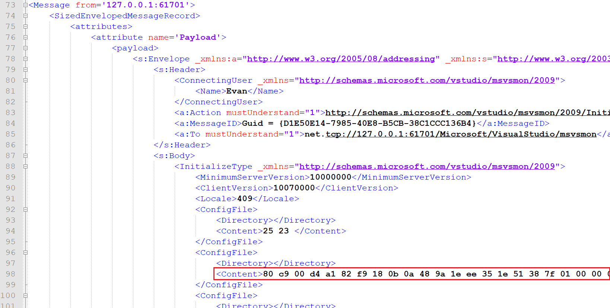
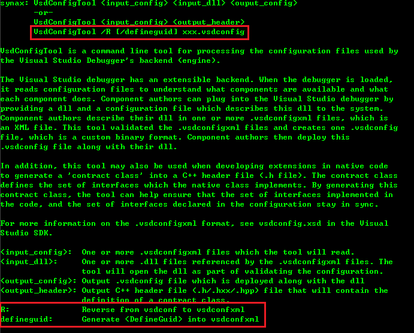

# vsdconfigtool is a tools to Reverse the .vsconfig file in Visual Studio Remote Debugger

## what is features provided?

By using the tool I provided (https://github.com/c0mpi1ors/RemoteDebuggerMate), I can find out what SOAP between Visual Studio and Remote Debugger Tools.

The <Content> in the <ConfigFile> is a binary .vsconfig file that provided by Visual Studio and we can find it same as a file (Program Files (x86)\Microsoft Visual Studio\2019\Community\Common7\IDE\Remote Debugger\x64\GpuEnvSetup.vsdconfig).
Microsoft already provided the vsdconfigtool.exe to generate vsconfig file from vsconfigxml file. 
so I provide this vsdconfigtool.exe with the feature that get vsdconfigxml file back from vsdconfig file.

The generated vsdconfigxml file will be like: 
```XML
<?xml version="1.0" encoding="utf-8"?>
<Configuration xmlns:xsi="http://www.w3.org/2001/XMLSchema-instance" xmlns:xsd="http://www.w3.org/2001/XMLSchema" xmlns="http://schemas.microsoft.com/vstudio/vsdconfig/2008">
  <NativeComponent ComponentId="c5d8535c-4dfe-42c7-a65f-301163c92a11" ComponentLevel="0" ModuleName="GpuEnvSetup.dll">
    <Class Name="GpuEnvSetup.CGpuEnvSetup" ClassId="3d4276bf-b2ee-4a1f-b788-0e1edb47d4a6">
      <Implements>
        <InterfaceGroup>
          <Interface Name="IDkmProcessLaunchEnvironmentFilter" />
        </InterfaceGroup>
      </Implements>
    </Class>
  </NativeComponent>
</Configuration>
```

## Versions

	Version 0.1
	
## Change Logs

### 11 Nov 2021
* Create repository.